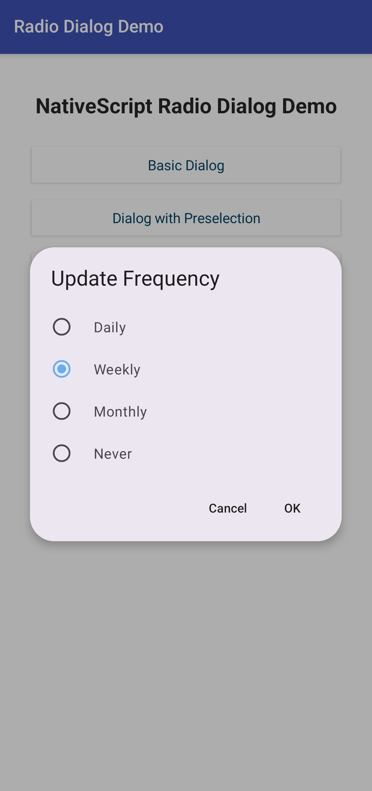
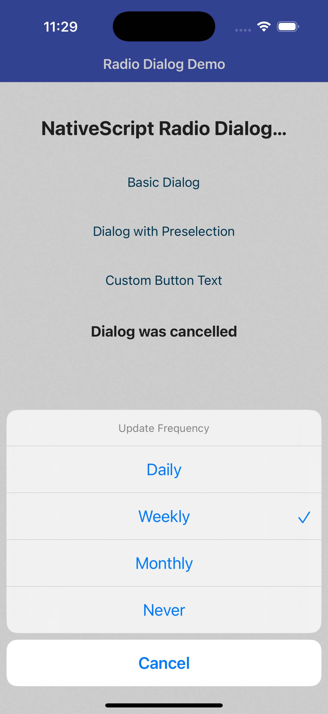

# NativeScript Radio Dialog

[](https://www.npmjs.com/package/nativescript-radio-dialog)
[](https://www.npmjs.com/package/nativescript-radio-dialog)

A NativeScript plugin that provides radio button dialogs for both Android and iOS. This plugin fills the gap where standard NativeScript dialogs don't support radio button lists, offering a native implementation.

## Features

- 📱 **Cross-platform**: Works on both Android and iOS
- 🎨 **Material Design**: Automatic Material Design 2/3 support based on your app theme
- 🔧 **Easy to use**: Simple Promise-based API
- ⚡ **Lightweight**: No external dependencies beyond NativeScript core
- 🎯 **TypeScript**: Full TypeScript support with type definitions
- 🔔 **Live selection**: Optional `onItemSelect` callback for immediate per-tap notifications

## Installation

```bash
npm install nativescript-radio-dialog
```

## Material Design Support

The plugin automatically detects your app's Material Design theme and uses the appropriate dialog style:

- **Material Design 3**: Used when your app has `Theme.Material3.*` theme on Android 12+
- **Material Design 2**: Used as fallback for older Android versions or `Theme.MaterialComponents.*` themes
- **iOS**: Uses native `UIAlertController` with action sheet style

## Usage

### TypeScript/JavaScript

```typescript
import { RadioDialog } from "nativescript-radio-dialog";

// Basic usage
const result = await RadioDialog.show({
    title: "Select Language",
    items: ["English", "Русский", "Español", "Français"]
});

if (!result.cancelled) {
    console.log(`Selected: ${result.selectedItem} (index: ${result.selectedIndex})`);
}

// With preselected option
const result = await RadioDialog.show({
    title: "Update Frequency",
    items: ["Daily", "Weekly", "Monthly", "Never"],
    selectedIndex: 1, // Pre-select "Weekly"
    cancelButtonText: "Skip"
});

// With custom button labels
const result = await RadioDialog.show({
    title: "Save Options",
    items: ["Save to Cloud", "Save Locally", "Don't Save"],
    selectedIndex: 0,
    okButtonText: "Apply",
    cancelButtonText: "Skip"
});

// With live selection callback
let currentIndex = -1;

const result = await RadioDialog.show({
    title: "Select Theme",
    items: ["Light", "Dark", "System"],
    onItemSelect: ({ selectedIndex, selectedItem }) => {
        // Called immediately on every tap, before the dialog closes.
        // On Android the dialog stays open; on iOS it fires alongside Promise resolution.
        currentIndex = selectedIndex;
        applyThemePreview(selectedItem);
    }
});

if (result.cancelled) {
    // On Android with onItemSelect the dialog can only be closed via Cancel,
    // so this always means the user dismissed the dialog
    revertThemePreview();
}
```

### Vue.js

```vue
<template>
    <StackLayout>
        <Button @tap="showLanguageDialog" text="Select Language" />
        <Label :text="selectedLanguage" />
    </StackLayout>
</template>

<script>
import { RadioDialog } from "nativescript-radio-dialog";

export default {
    data() {
        return {
            selectedLanguage: "No language selected"
        };
    },
    methods: {
        async showLanguageDialog() {
            try {
                const result = await RadioDialog.show({
                    title: "Select Language",
                    items: ["English", "Русский", "Español", "Français"],
                    cancelButtonText: "Cancel"
                });

                if (!result.cancelled) {
                    this.selectedLanguage = `Selected: ${result.selectedItem}`;
                }
            } catch (error) {
                console.error("Dialog error:", error);
            }
        }
    }
};
</script>
```

## API

### RadioDialog.show(options)

Shows a radio button dialog and returns a Promise that resolves with the user's selection.

#### Options

| Property | Type | Default | Description |
| --- | --- | --- | --- |
| `title` | `string` | **Required** | Dialog title text |
| `items` | `string[]` | **Required** | Array of options to display |
| `selectedIndex` | `number` | `-1` | Index of initially selected item (0-based) |
| `okButtonText` | `string` | `"OK"` | Text for the OK button (Android only, hidden when `onItemSelect` is set) |
| `cancelButtonText` | `string` | `"Cancel"` | Text for the cancel button |
| `onItemSelect` | `(result: { selectedIndex: number; selectedItem: string }) => void` | - | Callback fired immediately on each item tap (see [Live selection](#live-selection)) |

#### Returns: `Promise<RadioDialogResult>`

| Property | Type | Description |
| --- | --- | --- |
| `selectedIndex` | `number` | Index of selected item (0-based), or -1 if cancelled |
| `selectedItem` | `string` | Text of selected item, or empty string if cancelled |
| `cancelled` | `boolean` | `true` if dialog was cancelled, `false` if item was selected |

## Screenshots

<details>
<summary>Android Material You</summary>



</details>

<details>
<summary>iOS</summary>



</details>

## Live selection

When `onItemSelect` is provided the dialog notifies you on every tap without waiting for confirmation:

- **Android**: the dialog remains open after each tap. `onItemSelect` fires for every selection change. Because the OK button is hidden, the only way to close the dialog is Cancel or the back gesture - so the Promise always resolves with `cancelled: true`, meaning the user dismissed the dialog.
- **iOS**: tapping an item closes the dialog immediately (native behavior). `onItemSelect` fires first, then the Promise resolves with the same result - both carry the selected item.

Without `onItemSelect`: Android shows OK and Cancel buttons - the Promise resolves with the selected item only after the user confirms with OK; iOS closes and resolves on tap directly.

## Platform Differences

### Android
- Uses Material Design dialogs with radio buttons
- Shows OK and Cancel buttons by default; OK is hidden when `onItemSelect` is provided
- Supports Material Design 2 and 3 themes

### iOS
- Uses native `UIAlertController` with action sheet style
- Each item is a separate action button - tapping selects and closes immediately
- Only shows Cancel button
- Automatically handles iPad positioning

## Requirements

- NativeScript 8.0+
- Android API 21+ (Android 5.0+)
- iOS 12.0+

## License

Apache License Version 2.0
